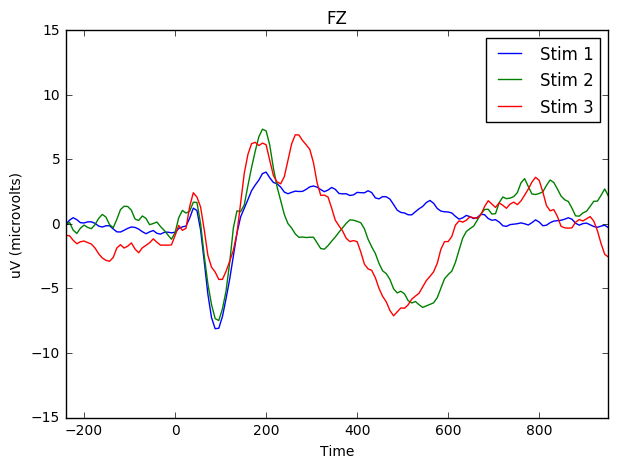
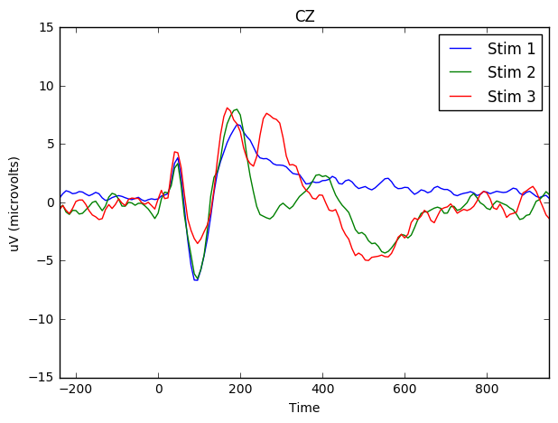
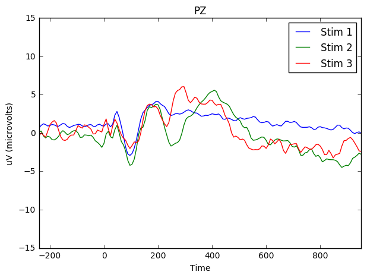

# ERPs in Python

**This tutorial is meant to be a companion to my R equivalent.** See the same script in R [here](https://github.com/mjtat/Plotting-event-related-potentials-in-R/blob/master/Plotting%20Data%20for%20the%20Cognision%20EEG%20System%20in%20R.ipynb).

**The following script will take data files output by the *COGNISION(tm)* EEG system developed by Neuronetrix.** The script find the grand average, and plot the resulting event-related potentials (ERPs). The Cognision system is a 7-electrode system used for both clinical and research purposes. In this example, we take the grand average of all the midline electrodes (FZ, CZ, PZ) from five individuals.


**First, import all the important libraries you need.** Specifically, pandas, numpy, glob2 (to get file names), os (to set working directory), and matplotlib.


```python
%matplotlib inline
import pandas as pd
import numpy as np
import glob2
import os
import matplotlib.pyplot as plt
```

**Next, set the working directory** (just so it's easier to import files).


```python
os.chdir('/media/mihcelle/ChelleUSB/Cognision')
```

**We need to find all the files in the directory.** We do this using the `glob` library in python. It will search through all files in a directory matching some string input (in this case, .xlsx).


```python
files = glob2.glob('*.xlsx')
files
```


    ['2490_1572_average.xlsx',
     '2504_2098_average.xlsx',
     '2514_1748_average.xlsx',
     '2536_1455_average.xlsx',
     '3097_1981_average.xlsx']


**R has a list object to store multiple items (like dataframes). Python, in turn, uses `dict`s to achieve something similar.** In the line below, I'm telling python to read in the excel files in the folder. The keys are the file names and the values are the dataframes themselves. The dict object is labeled `x`.

Just to check, I print out the first ten lines of the first data frame in the x dict.


```python
x = {file: pd.read_excel(file, sheetname = 2) for file in files}
x.values()[1].head(10)
```


<div>
<table border="1" class="dataframe">
  <thead>
    <tr style="text-align: right;">
      <th></th>
      <th>Time</th>
      <th>FZ</th>
      <th>CZ</th>
      <th>PZ</th>
      <th>F3</th>
      <th>P3</th>
      <th>F4</th>
      <th>P4</th>
      <th>Stimulus</th>
    </tr>
  </thead>
  <tbody>
    <tr>
      <th>0</th>
      <td>-240</td>
      <td>0.913900</td>
      <td>0.251298</td>
      <td>0.125067</td>
      <td>0.603175</td>
      <td>-0.285071</td>
      <td>1.029497</td>
      <td>1.770241</td>
      <td>1</td>
    </tr>
    <tr>
      <th>1</th>
      <td>-232</td>
      <td>1.150180</td>
      <td>0.523645</td>
      <td>0.429780</td>
      <td>0.901415</td>
      <td>0.111195</td>
      <td>1.087295</td>
      <td>1.880752</td>
      <td>1</td>
    </tr>
    <tr>
      <th>2</th>
      <td>-224</td>
      <td>1.969993</td>
      <td>1.346232</td>
      <td>1.329586</td>
      <td>1.810007</td>
      <td>1.216764</td>
      <td>1.929303</td>
      <td>2.901241</td>
      <td>1</td>
    </tr>
    <tr>
      <th>3</th>
      <td>-216</td>
      <td>2.290890</td>
      <td>1.546908</td>
      <td>1.630600</td>
      <td>2.060621</td>
      <td>1.399869</td>
      <td>2.166045</td>
      <td>3.213815</td>
      <td>1</td>
    </tr>
    <tr>
      <th>4</th>
      <td>-208</td>
      <td>1.505756</td>
      <td>0.776108</td>
      <td>0.904190</td>
      <td>1.318026</td>
      <td>0.368282</td>
      <td>0.954127</td>
      <td>2.228467</td>
      <td>1</td>
    </tr>
    <tr>
      <th>5</th>
      <td>-200</td>
      <td>0.902340</td>
      <td>0.260546</td>
      <td>0.458910</td>
      <td>1.014700</td>
      <td>0.036751</td>
      <td>0.130615</td>
      <td>1.590835</td>
      <td>1</td>
    </tr>
    <tr>
      <th>6</th>
      <td>-192</td>
      <td>1.204742</td>
      <td>0.694728</td>
      <td>1.002678</td>
      <td>1.677764</td>
      <td>0.818648</td>
      <td>0.825584</td>
      <td>2.166508</td>
      <td>1</td>
    </tr>
    <tr>
      <th>7</th>
      <td>-184</td>
      <td>1.381836</td>
      <td>1.091919</td>
      <td>1.400794</td>
      <td>1.988488</td>
      <td>1.361028</td>
      <td>1.371201</td>
      <td>2.532719</td>
      <td>1</td>
    </tr>
    <tr>
      <th>8</th>
      <td>-176</td>
      <td>0.717847</td>
      <td>0.470008</td>
      <td>0.866274</td>
      <td>1.297681</td>
      <td>0.790442</td>
      <td>0.538441</td>
      <td>1.737874</td>
      <td>1</td>
    </tr>
    <tr>
      <th>9</th>
      <td>-168</td>
      <td>0.095936</td>
      <td>-0.156065</td>
      <td>0.465846</td>
      <td>0.876909</td>
      <td>0.382616</td>
      <td>-0.442745</td>
      <td>1.268089</td>
      <td>1</td>
    </tr>
  </tbody>
</table>
</div>


**The names of each key is a bit much.** Let's do a for loop to change the names of each key into something manageable.

Basically, for the length of `x`, assign the ith key name to the variable `name`, convert `i` to a string, print `i` to check it's working, then remove the old key name and replace it with the new key name.


```python
for i in range(len(x)):
    name = x.keys()[i]
    i = str(i)
    print i
    x[i] = x.pop(name)
```

    0
    1
    2
    3
    4


**Ultimately, we want to populate a new data frame with all the values in our x dict.** First we create an empty dictionary named `EEG_data`.


```python
EEG_data = pd.DataFrame()     
```

In the following for loop, for the ith item in the range of length(x), convert i into a string, then append x[i] to the empty `EEG_data` data frame. Loop until there are no more items to go through in x.


```python
for i in range(len(x)):
    i = str(i)
    EEG_data = EEG_data.append(x[i])
```

**From here, we need to gather the grand mean for all elements.** Or in other words, find the mean for each individual cell across ALL subjects.

This is achieved by simply aggregating `EEG_data` by it's index, and finding the mean.

We end up with the grand means when calling `means = row_index.mean()`


```python
row_index = EEG_data.groupby(EEG_data.index)
means = row_index.mean()
means.head(10)
```


<div>
<table border="1" class="dataframe">
  <thead>
    <tr style="text-align: right;">
      <th></th>
      <th>Time</th>
      <th>FZ</th>
      <th>CZ</th>
      <th>PZ</th>
      <th>F3</th>
      <th>P3</th>
      <th>F4</th>
      <th>P4</th>
      <th>Stimulus</th>
    </tr>
  </thead>
  <tbody>
    <tr>
      <th>0</th>
      <td>-240</td>
      <td>-0.039821</td>
      <td>0.349694</td>
      <td>0.668002</td>
      <td>0.007620</td>
      <td>0.441710</td>
      <td>-0.047589</td>
      <td>0.558231</td>
      <td>1</td>
    </tr>
    <tr>
      <th>1</th>
      <td>-232</td>
      <td>0.277747</td>
      <td>0.723581</td>
      <td>0.991673</td>
      <td>0.498491</td>
      <td>0.835016</td>
      <td>0.218099</td>
      <td>0.802094</td>
      <td>1</td>
    </tr>
    <tr>
      <th>2</th>
      <td>-224</td>
      <td>0.469915</td>
      <td>0.984368</td>
      <td>1.188373</td>
      <td>0.690752</td>
      <td>1.095063</td>
      <td>0.325650</td>
      <td>0.928789</td>
      <td>1</td>
    </tr>
    <tr>
      <th>3</th>
      <td>-216</td>
      <td>0.316125</td>
      <td>0.895682</td>
      <td>1.082024</td>
      <td>0.389830</td>
      <td>0.843432</td>
      <td>0.118593</td>
      <td>0.787853</td>
      <td>1</td>
    </tr>
    <tr>
      <th>4</th>
      <td>-208</td>
      <td>0.081047</td>
      <td>0.730794</td>
      <td>0.900028</td>
      <td>0.180923</td>
      <td>0.498306</td>
      <td>-0.141546</td>
      <td>0.632768</td>
      <td>1</td>
    </tr>
    <tr>
      <th>5</th>
      <td>-200</td>
      <td>0.061627</td>
      <td>0.777218</td>
      <td>0.964207</td>
      <td>0.328610</td>
      <td>0.639889</td>
      <td>-0.214696</td>
      <td>0.630456</td>
      <td>1</td>
    </tr>
    <tr>
      <th>6</th>
      <td>-192</td>
      <td>0.149111</td>
      <td>0.913437</td>
      <td>1.100982</td>
      <td>0.558971</td>
      <td>0.908166</td>
      <td>-0.123975</td>
      <td>0.630086</td>
      <td>1</td>
    </tr>
    <tr>
      <th>7</th>
      <td>-184</td>
      <td>0.145874</td>
      <td>0.874134</td>
      <td>1.043646</td>
      <td>0.679654</td>
      <td>0.844264</td>
      <td>-0.043150</td>
      <td>0.456044</td>
      <td>1</td>
    </tr>
    <tr>
      <th>8</th>
      <td>-176</td>
      <td>0.034624</td>
      <td>0.699074</td>
      <td>0.890780</td>
      <td>0.581905</td>
      <td>0.571825</td>
      <td>-0.101226</td>
      <td>0.276082</td>
      <td>1</td>
    </tr>
    <tr>
      <th>9</th>
      <td>-168</td>
      <td>-0.180387</td>
      <td>0.557769</td>
      <td>0.865904</td>
      <td>0.340539</td>
      <td>0.493220</td>
      <td>-0.281557</td>
      <td>0.320194</td>
      <td>1</td>
    </tr>
  </tbody>
</table>
</div>


In the next three parts, we are simply subsetting the previous data frame into separate dataframes, corresponding to the Stimulus number (1, 2, or 3).


```python
means_stim_1 = means[(means.Stimulus == 1)]
means_stim_1.head(5)
```


<div>
<table border="1" class="dataframe">
  <thead>
    <tr style="text-align: right;">
      <th></th>
      <th>Time</th>
      <th>FZ</th>
      <th>CZ</th>
      <th>PZ</th>
      <th>F3</th>
      <th>P3</th>
      <th>F4</th>
      <th>P4</th>
      <th>Stimulus</th>
    </tr>
  </thead>
  <tbody>
    <tr>
      <th>0</th>
      <td>-240</td>
      <td>-0.039821</td>
      <td>0.349694</td>
      <td>0.668002</td>
      <td>0.007620</td>
      <td>0.441710</td>
      <td>-0.047589</td>
      <td>0.558231</td>
      <td>1</td>
    </tr>
    <tr>
      <th>1</th>
      <td>-232</td>
      <td>0.277747</td>
      <td>0.723581</td>
      <td>0.991673</td>
      <td>0.498491</td>
      <td>0.835016</td>
      <td>0.218099</td>
      <td>0.802094</td>
      <td>1</td>
    </tr>
    <tr>
      <th>2</th>
      <td>-224</td>
      <td>0.469915</td>
      <td>0.984368</td>
      <td>1.188373</td>
      <td>0.690752</td>
      <td>1.095063</td>
      <td>0.325650</td>
      <td>0.928789</td>
      <td>1</td>
    </tr>
    <tr>
      <th>3</th>
      <td>-216</td>
      <td>0.316125</td>
      <td>0.895682</td>
      <td>1.082024</td>
      <td>0.389830</td>
      <td>0.843432</td>
      <td>0.118593</td>
      <td>0.787853</td>
      <td>1</td>
    </tr>
    <tr>
      <th>4</th>
      <td>-208</td>
      <td>0.081047</td>
      <td>0.730794</td>
      <td>0.900028</td>
      <td>0.180923</td>
      <td>0.498306</td>
      <td>-0.141546</td>
      <td>0.632768</td>
      <td>1</td>
    </tr>
  </tbody>
</table>
</div>


```python
means_stim_2 = means[(means.Stimulus == 2)]
means_stim_2.head(5)
```


<div>
<table border="1" class="dataframe">
  <thead>
    <tr style="text-align: right;">
      <th></th>
      <th>Time</th>
      <th>FZ</th>
      <th>CZ</th>
      <th>PZ</th>
      <th>F3</th>
      <th>P3</th>
      <th>F4</th>
      <th>P4</th>
      <th>Stimulus</th>
    </tr>
  </thead>
  <tbody>
    <tr>
      <th>150</th>
      <td>-240</td>
      <td>-0.135720</td>
      <td>-0.526437</td>
      <td>0.112582</td>
      <td>-0.702145</td>
      <td>0.118593</td>
      <td>-0.221724</td>
      <td>0.562485</td>
      <td>2</td>
    </tr>
    <tr>
      <th>151</th>
      <td>-232</td>
      <td>0.110270</td>
      <td>-0.256403</td>
      <td>0.246212</td>
      <td>-0.421475</td>
      <td>0.218931</td>
      <td>0.206909</td>
      <td>0.585605</td>
      <td>2</td>
    </tr>
    <tr>
      <th>152</th>
      <td>-224</td>
      <td>-0.489909</td>
      <td>-0.839936</td>
      <td>-0.391883</td>
      <td>-0.986513</td>
      <td>-0.307266</td>
      <td>-0.500081</td>
      <td>-0.251317</td>
      <td>2</td>
    </tr>
    <tr>
      <th>153</th>
      <td>-216</td>
      <td>-0.753007</td>
      <td>-1.042462</td>
      <td>-0.653594</td>
      <td>-1.142338</td>
      <td>-0.544008</td>
      <td>-1.054946</td>
      <td>-0.497307</td>
      <td>2</td>
    </tr>
    <tr>
      <th>154</th>
      <td>-208</td>
      <td>-0.342407</td>
      <td>-0.693822</td>
      <td>-0.415002</td>
      <td>-0.573601</td>
      <td>-0.163926</td>
      <td>-0.640647</td>
      <td>-0.268425</td>
      <td>2</td>
    </tr>
  </tbody>
</table>
</div>


```python
means_stim_3 = means[(means.Stimulus == 3)]
means_stim_3.head(5)
```


<div>
<table border="1" class="dataframe">
  <thead>
    <tr style="text-align: right;">
      <th></th>
      <th>Time</th>
      <th>FZ</th>
      <th>CZ</th>
      <th>PZ</th>
      <th>F3</th>
      <th>P3</th>
      <th>F4</th>
      <th>P4</th>
      <th>Stimulus</th>
    </tr>
  </thead>
  <tbody>
    <tr>
      <th>300</th>
      <td>-240</td>
      <td>-0.905595</td>
      <td>-0.623308</td>
      <td>-0.356972</td>
      <td>-0.712086</td>
      <td>-0.694053</td>
      <td>-1.458380</td>
      <td>-0.705150</td>
      <td>3</td>
    </tr>
    <tr>
      <th>301</th>
      <td>-232</td>
      <td>-0.927790</td>
      <td>-0.282066</td>
      <td>0.007158</td>
      <td>-0.909757</td>
      <td>0.080677</td>
      <td>-1.409135</td>
      <td>-0.542159</td>
      <td>3</td>
    </tr>
    <tr>
      <th>302</th>
      <td>-224</td>
      <td>-1.280823</td>
      <td>-0.689198</td>
      <td>-0.298018</td>
      <td>-1.425088</td>
      <td>-0.194674</td>
      <td>-1.459767</td>
      <td>-0.910450</td>
      <td>3</td>
    </tr>
    <tr>
      <th>303</th>
      <td>-216</td>
      <td>-1.543690</td>
      <td>-0.970792</td>
      <td>-0.547014</td>
      <td>-1.467396</td>
      <td>-0.571289</td>
      <td>-1.837769</td>
      <td>-1.075523</td>
      <td>3</td>
    </tr>
    <tr>
      <th>304</th>
      <td>-208</td>
      <td>-1.391796</td>
      <td>-0.524126</td>
      <td>0.229104</td>
      <td>-1.147655</td>
      <td>0.172924</td>
      <td>-1.834994</td>
      <td>-0.420088</td>
      <td>3</td>
    </tr>
  </tbody>
</table>
</div>


**Now we can plot.** We use both the pandas wrapper for matplotlib, as well as matplotlib itself.

The first line specifies the subplot (to overlay lines later on). The second line sets the axis labels. The third through fifth lines specify each data to overlay on the plots (specifically for Stims 1,2 and 3).

Note that this first plot is for the electrode 'FZ' (the electrode at the front of the scalp).


```python
fig, ax = plt.subplots()
ax.set(xlabel="Time (in milliseconds)", ylabel="uV (microvolts)")
means_stim_1.plot(x = 'Time', y = 'FZ', kind = 'line', ylim = (-15,15), xlim = (-200,1000), ax=ax, label = 'Stim 1', figsize = (7,5), title = 'FZ')
means_stim_2.plot(x = 'Time', y = 'FZ',ax=ax, label = 'Stim 2')
means_stim_3.plot(x = 'Time', y = 'FZ',ax=ax, label = 'Stim 3')

```


    <matplotlib.axes._subplots.AxesSubplot at 0x7f221f32f990>





**We can do the same for CZ (the electrode at the center of the scalp).**


```python
fig, ax = plt.subplots()
ax.set(xlabel="Time (in milliseconds)", ylabel="uV (microvolts)")
means_stim_1.plot(x = 'Time', y = 'CZ', kind = 'line', ylim = (-15,15), xlim = (-200,1000), ax=ax, label = 'Stim 1', figsize = (7,5), title = 'CZ')
means_stim_2.plot(x = 'Time', y = 'CZ',ax=ax, label = 'Stim 2')
means_stim_3.plot(x = 'Time', y = 'CZ',ax=ax, label = 'Stim 3')
```


    <matplotlib.axes._subplots.AxesSubplot at 0x7f221cd8d490>





**And the same for PZ (the electrode at the back of the scalp).**


```python
fig, ax = plt.subplots()
ax.set(xlabel="Time (in milliseconds)", ylabel="uV (microvolts)")
means_stim_1.plot(x = 'Time', y = 'PZ', kind = 'line', ylim = (-15,15), xlim = (-200,1000), ax=ax, label = 'Stim 1', figsize = (7,5), title = 'PZ')
means_stim_2.plot(x = 'Time', y = 'PZ',ax=ax, label = 'Stim 2')
means_stim_3.plot(x = 'Time', y = 'PZ',ax=ax, label = 'Stim 3')
```


    <matplotlib.axes._subplots.AxesSubplot at 0x7f221cc45810>





**The results are remarkably similar to it's R equivalent!**
